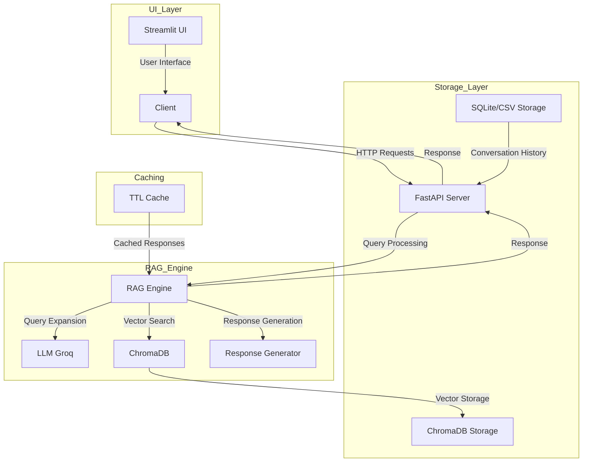
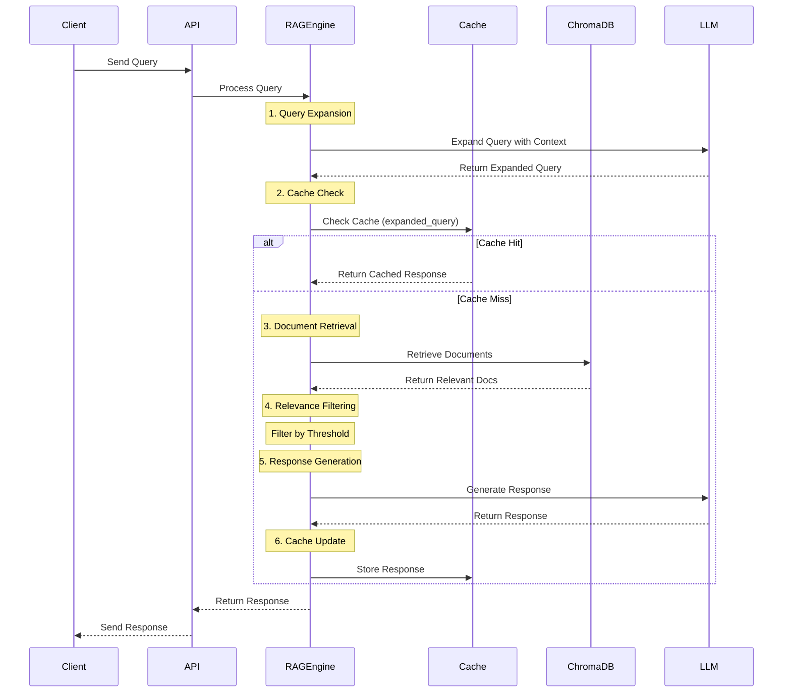

# Customer Support AI Assistant

An AI-powered customer support assistant that uses Retrieval-Augmented Generation (RAG) with the Groq LLM to provide intelligent responses to customer queries.

## Features

- RAG-based response generation using customer support dataset
- Multi-turn conversation support
- Response evaluation and explainability
- Flexible storage options (SQLite or CSV)
- FastAPI-based REST API
- Vector database (ChromaDB) for efficient retrieval

## Project Structure

```
customer-support-ai-assistant/
├── src/
│   ├── customer_support_ai/
│   │   ├── api/
│   │   │   ├── app.py
│   │   │   └── routes.py
│   │   ├── core/
│   │   │   ├── config.py
│   │   │   └── rag_engine.py
│   │   ├── database/
│   │   │   ├── __init__.py
│   │   │   ├── base.py
│   │   │   ├── models.py
│   │   │   ├── sqlite_storage.py
│   │   │   └── csv_storage.py
│   │   ├── utils/
│   │   │     └── dataset_loader.py
│   │   └── ui/
│   │       └── app.py
│   └── main.py
├── tests/
│   ├── test_rag_engine.py
├── requirements.txt
├── setup.py
└── README.md
```

## Prerequisites

- Python 3.8+
- Groq API key

## Installation

1. Clone the repository:
```bash
git clone <repository-url>
cd customer-support-ai-assistant
```

2. Create a virtual environment and activate it:
```bash
python -m venv venv
source venv/bin/activate  # On Windows: venv\Scripts\activate
```

3. Install the package in development mode:
```bash
pip install -e ".[dev]"
```

Alternatively, you can install dependencies directly from requirements.txt:
```bash
pip install -r requirements.txt
```

4. Create a `.env` file in the root directory with your configuration:
```
GROQ_API_KEY=your_api_key_here

# Storage Configuration (optional)
STORAGE_TYPE=sqlite  # or 'csv'
DATABASE_URL=customer_support.db  # for SQLite
CSV_STORAGE_PATH=interactions.csv  # for CSV

# Caching
ENABLE_RESPONSE_CACHE=true
CACHE_TTL_HOURS=1  
CACHE_MAX_SIZE=1000 

# Relevance threshold for RAG
RELEVANCE_THRESHOLD=0.6

```

## Storage Options

The system supports two storage backends:

1. **SQLite** (default):
   - Robust relational database
   - Better for concurrent access
   - Requires SQLite installation

2. **CSV**:
   - Simple file-based storage
   - Easy to export and analyze data
   - Good for simple deployments
   - Fallback option if SQLite is not available

To switch between storage options, set the `STORAGE_TYPE` environment variable to either `sqlite` or `csv`.

## Setup

1. Load the customer support dataset into the vector database:
```bash
python -m customer_support_ai.utils.dataset_loader
```

2. Start the API server:
```bash
python src/main.py
```

The API will be available at `http://localhost:8000`

3. Start the Streamlit UI (if want to run UI):
```bash
streamlit run src/customer_support_ai/ui/app.py
```

The UI will open in your default web browser at `http://localhost:8501`

## API Endpoints

### Generate Response
- **POST** `/api/v1/generate_response`
- Generates a response for a customer query
- Request body:
```json
{
    "query": "Your customer query here",
    "conversation_id": "optional_conversation_id",
    "max_history_length": 5
}
```

### Get Conversation History
- **GET** `/api/v1/conversation/{conversation_id}`
- Retrieves conversation history for a given conversation ID
- Optional query parameter: `limit` (default: 10)

### Health Check
- **GET** `/api/v1/health`
- Returns the health status of the API and current storage type

## Development

### Code Style

The project uses:
- Black for code formatting
- isort for import sorting
- flake8 for linting
- mypy for type checking

To format code:
```bash
black src/
isort src/
```

To run linting:
```bash
flake8 src/
mypy src/
```

### Testing

Run tests with pytest:
```bash
pytest tests/
```

## Architecture

The system is built with a modular architecture that combines RAG (Retrieval-Augmented Generation) with efficient caching and storage mechanisms.

### System Architecture



### Response Generation Flow



### Key Components

- **RAG Engine**: Uses ChromaDB for vector storage and retrieval, combined with Groq LLM for response generation
- **Storage**: Flexible storage system with SQLite and CSV options
- **API**: FastAPI for handling HTTP requests and responses
- **Evaluation**: Basic metrics for response quality and relevance
- **Caching**: TTL-based response caching for improved performance
- **UI**: Streamlit-based interface for user interaction

## Contributing

1. Fork the repository
2. Create a feature branch
3. Commit your changes
4. Push to the branch
5. Create a Pull Request

## License

This project is licensed under the MIT License - see the LICENSE file for details.
